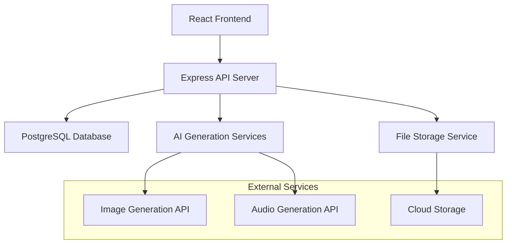

# 設計書

## 概要

ゲーム開発用アセット管理・生成サービスは、Webベースのアプリケーションとして構築され、フロントエンドにReact、バックエンドにNode.js/Express、データベースにPostgreSQLを使用します。AI生成機能は外部APIとの統合により実現し、ファイルストレージにはクラウドストレージサービスを活用します。

## アーキテクチャ

### システム構成



### 技術スタック

**フロントエンド:**
- React 18 with TypeScript
- Material-UI for UI components
- React Query for state management and caching
- React Router for navigation
- Axios for HTTP requests

**バックエンド:**
- Node.js with Express.js
- TypeScript for type safety
- Prisma ORM for database operations
- Multer for file upload handling
- JWT for authentication

**データベース:**
- PostgreSQL for relational data
- Redis for caching and session management

**インフラストラクチャ:**
- AWS S3 for file storage
- OpenAI API for image generation
- Suno API for audio generation
- Docker for containerization

## コンポーネントとインターフェース

### フロントエンドコンポーネント

#### 1. AssetLibrary Component
- **責任**: アセットの一覧表示、検索、フィルタリング
- **Props**: 
  - `assets: Asset[]`
  - `onSearch: (query: string) => void`
  - `onFilter: (filters: FilterOptions) => void`
- **State**: 検索クエリ、フィルタ設定、選択されたアセット

#### 2. AssetUpload Component
- **責任**: ファイルアップロード、メタデータ入力
- **Props**:
  - `onUpload: (file: File, metadata: AssetMetadata) => void`
  - `supportedFormats: string[]`
- **State**: アップロード進行状況、エラー状態

#### 3. PromptManager Component
- **責任**: プロンプトの作成、編集、実行
- **Props**:
  - `prompts: Prompt[]`
  - `onSave: (prompt: Prompt) => void`
  - `onExecute: (prompt: Prompt) => void`
- **State**: 現在のプロンプト、生成状況

#### 4. ProjectManager Component
- **責任**: プロジェクトの作成、管理、アセット関連付け
- **Props**:
  - `projects: Project[]`
  - `assets: Asset[]`
  - `onCreateProject: (project: Project) => void`
- **State**: 選択されたプロジェクト、関連付けられたアセット

### バックエンドAPI エンドポイント

#### Assets API
```typescript
// アセット関連のエンドポイント
POST /api/assets/upload          // アセットアップロード
GET /api/assets                  // アセット一覧取得
GET /api/assets/:id              // 特定アセット取得
PUT /api/assets/:id              // アセット更新
DELETE /api/assets/:id           // アセット削除
GET /api/assets/search           // アセット検索
```

#### Prompts API
```typescript
// プロンプト関連のエンドポイント
POST /api/prompts                // プロンプト作成
GET /api/prompts                 // プロンプト一覧取得
PUT /api/prompts/:id             // プロンプト更新
DELETE /api/prompts/:id          // プロンプト削除
POST /api/prompts/:id/execute    // プロンプト実行
```

#### Projects API
```typescript
// プロジェクト関連のエンドポイント
POST /api/projects               // プロジェクト作成
GET /api/projects                // プロジェクト一覧取得
PUT /api/projects/:id            // プロジェクト更新
DELETE /api/projects/:id         // プロジェクト削除
POST /api/projects/:id/assets    // アセットをプロジェクトに関連付け
```

#### Generation API
```typescript
// AI生成関連のエンドポイント
POST /api/generate/image         // 画像生成
POST /api/generate/audio         // 音声生成
GET /api/generate/status/:jobId  // 生成状況確認
```

## データモデル

### Asset Model
```typescript
interface Asset {
  id: string;
  filename: string;
  originalName: string;
  fileType: 'image' | 'audio';
  mimeType: string;
  fileSize: number;
  storageUrl: string;
  thumbnailUrl?: string;
  metadata: {
    width?: number;
    height?: number;
    duration?: number;
    bitrate?: number;
  };
  tags: string[];
  category: string;
  projectIds: string[];
  promptId?: string;
  createdAt: Date;
  updatedAt: Date;
  userId: string;
}
```

### Prompt Model
```typescript
interface Prompt {
  id: string;
  title: string;
  content: string;
  type: 'image' | 'audio';
  parameters: {
    style?: string;
    quality?: string;
    duration?: number;
    [key: string]: any;
  };
  category: string;
  usageCount: number;
  successRate: number;
  generatedAssets: string[];
  createdAt: Date;
  updatedAt: Date;
  userId: string;
}
```

### Project Model
```typescript
interface Project {
  id: string;
  name: string;
  description: string;
  assetIds: string[];
  createdAt: Date;
  updatedAt: Date;
  userId: string;
}
```

### User Model
```typescript
interface User {
  id: string;
  email: string;
  username: string;
  passwordHash: string;
  createdAt: Date;
  updatedAt: Date;
}
```

## エラーハンドリング

### フロントエンドエラーハンドリング
- **ネットワークエラー**: 再試行機能付きのエラー表示
- **ファイルアップロードエラー**: 進行状況とエラー詳細の表示
- **AI生成エラー**: 代替案の提案とエラー原因の説明
- **認証エラー**: 自動ログアウトとリダイレクト

### バックエンドエラーハンドリング
```typescript
// エラーレスポンス形式
interface ErrorResponse {
  error: {
    code: string;
    message: string;
    details?: any;
  };
  timestamp: string;
  path: string;
}

// エラーコード例
enum ErrorCodes {
  INVALID_FILE_TYPE = 'INVALID_FILE_TYPE',
  FILE_TOO_LARGE = 'FILE_TOO_LARGE',
  AI_SERVICE_UNAVAILABLE = 'AI_SERVICE_UNAVAILABLE',
  INSUFFICIENT_CREDITS = 'INSUFFICIENT_CREDITS',
  UNAUTHORIZED = 'UNAUTHORIZED'
}
```

### AI生成エラー処理
- **タイムアウト処理**: 長時間の生成に対する適切なタイムアウト設定
- **レート制限**: API制限に対する適切な待機とリトライ
- **品質チェック**: 生成されたアセットの品質検証
- **フォールバック**: 生成失敗時の代替手段提供

## テスト戦略

### ユニットテスト
- **フロントエンド**: Jest + React Testing Library
- **バックエンド**: Jest + Supertest
- **カバレッジ目標**: 80%以上

### 統合テスト
- **API統合テスト**: 全エンドポイントの動作確認
- **データベース統合テスト**: Prismaクエリの動作確認
- **外部サービス統合テスト**: AI APIとの連携確認

### E2Eテスト
- **Playwright**を使用したブラウザテスト
- **主要ユーザーフロー**のテスト自動化
- **クロスブラウザ対応**の確認

### テストシナリオ
1. **アセットアップロード**: ファイルアップロードから保存まで
2. **プロンプト実行**: プロンプト作成から生成完了まで
3. **プロジェクト管理**: プロジェクト作成からアセット関連付けまで
4. **検索・フィルタリング**: 様々な条件での検索動作
5. **エクスポート機能**: アセット選択からダウンロードまで